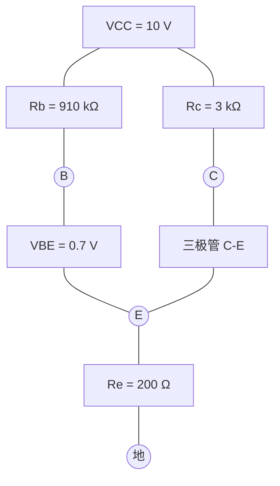
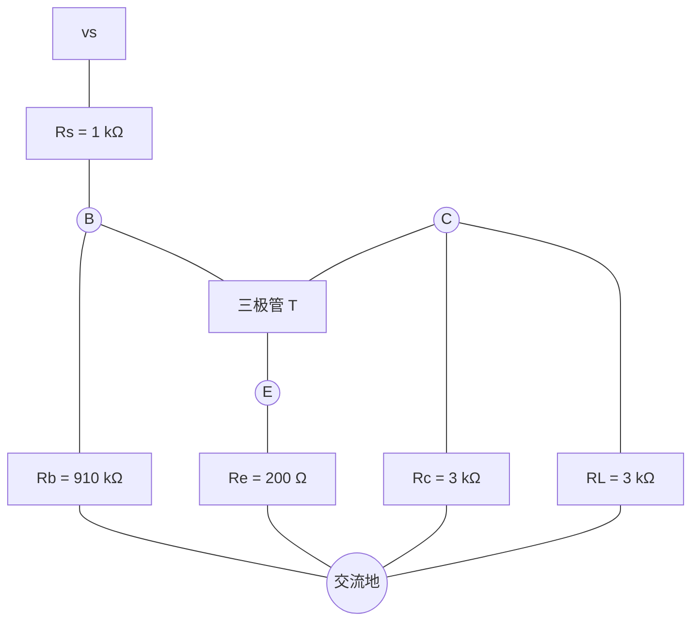
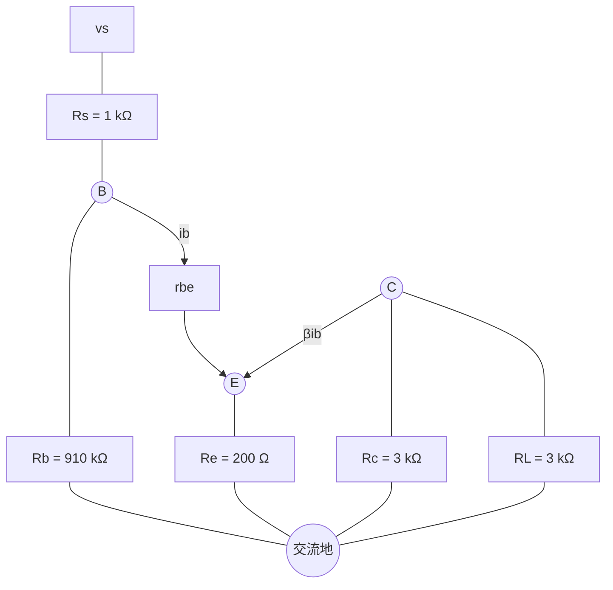

# 课堂习题 2：共射极放大电路计算题解析

> 本笔记围绕课堂习题 2 展开，保留原题、完整计算过程以及后续学习中产生的疑问。  
> 🔴 标记内容为必要补充或易错点，不改变原题的解题主线。

---

## 1. 原题与电路

已知三极管：

| 参数 | 数值 |
| --- | ---: |
| 电流放大系数 $\beta$ | $100$ |
| 基区体电阻 $r_{bb'}$ | $100\ \Omega$ |
| 导通压降 $V_{BE}$ | $0.7\ \text{V}$ |
| 电源 $V_{CC}$ | $10\ \text{V}$ |
| 基极偏置电阻 $R_b$ | $910\ \text{k}\Omega$ |
| 集电极电阻 $R_c$ | $3\ \text{k}\Omega$ |
| 发射极电阻 $R_e$ | $200\ \Omega$ |
| 信号源内阻 $R_s$ | $1\ \text{k}\Omega$ |
| 负载电阻 $R_L$ | $3\ \text{k}\Omega$ |

题目要求：

1. 画出直流通路、交流通路和微变等效电路；
2. 计算静态工作点 $I_{BQ}$、$I_{CQ}$ 和 $V_{CEQ}$；
3. 计算 $r_{be}$；
4. 计算 $R_i$、$A_v=v_o/v_i$、$A_{vs}=v_o/v_s$ 和 $R_o$。

---

## 2. 解题总思路

这道题必须分成两个阶段：

### 2.1 直流分析

- 电容 $C_1$、$C_2$ 视为开路；
- 信号源、$R_s$ 和负载 $R_L$ 均与三极管直流电路断开；
- 计算静态工作点和 $r_{be}$。

### 2.2 交流分析

- $C_1$、$C_2$ 在中频段视为短路；
- 直流电源 $V_{CC}$ 视为交流地；
- 三极管换成微变等效模型；
- 计算输入电阻、电压增益和输出电阻。

> 🔴 **补充：**“$r_{ce}$ 可以忽略”表示不考虑它对电路的影响，相当于 $r_{ce}\to\infty$，因此在微变等效电路中将它开路，而不是短路。

---

## 3. 直流通路、交流通路和微变等效电路

### 3.1 直流通路

直流时两个电容开路，直流回路可表示为：

基极直流回路：

$$
V_{CC}\rightarrow R_b\rightarrow B-E\rightarrow R_e\rightarrow \text{地}
$$

集电极直流回路：

$$
V_{CC}\rightarrow R_c\rightarrow C-E\rightarrow R_e\rightarrow \text{地}
$$

### 3.2 交流通路

交流时，两个耦合电容短路，$V_{CC}$ 变成交流地：

此时 $R_c$ 和 $R_L$ 都接在集电极与交流地之间，因此：

$$
R_c\parallel R_L
=3\ \text{k}\Omega\parallel3\ \text{k}\Omega
=1.5\ \text{k}\Omega
$$

### 3.3 微变等效电路

三极管用输入电阻 $r_{be}$ 和受控电流源 $\beta i_b$ 代替：

---

## 4. 静态工作点计算

### 4.1 计算基极电流 $I_{BQ}$

发射极电流不是 $I_B$，而是：

$$
I_{EQ}=I_{BQ}+I_{CQ}=(\beta+1)I_{BQ}
$$

沿基极直流回路列 KVL：

$$
V_{CC}=I_{BQ}R_b+V_{BE}+I_{EQ}R_e
$$

代入 $I_{EQ}=(\beta+1)I_{BQ}$：

$$
V_{CC}=I_{BQ}R_b+V_{BE}+(\beta+1)I_{BQ}R_e
$$

整理：

$$
I_{BQ}=\frac{V_{CC}-V_{BE}}
{R_b+(\beta+1)R_e}
$$

代入数据：

$$
I_{BQ}
=\frac{10-0.7}
{910\ \text{k}\Omega+101\times200\ \Omega}
\approx9.998\ \mu\text{A}
$$

所以：

$$
\boxed{I_{BQ}\approx10.0\ \mu\text{A}}
$$

### 4.2 计算集电极和发射极电流

$$
I_{CQ}=\beta I_{BQ}
$$

$$
I_{CQ}=100\times9.998\ \mu\text{A}
\approx0.9998\ \text{mA}
$$

$$
\boxed{I_{CQ}\approx1.00\ \text{mA}}
$$

发射极电流为：

$$
I_{EQ}=(\beta+1)I_{BQ}
\approx1.010\ \text{mA}
$$

### 4.3 计算 $V_{CEQ}$

集电极电位：

$$
V_C=V_{CC}-I_{CQ}R_c
$$

$$
V_C\approx10-1.00\ \text{mA}\times3\ \text{k}\Omega
=7.00\ \text{V}
$$

发射极电位：

$$
V_E=I_{EQ}R_e
$$

$$
V_E\approx1.010\ \text{mA}\times200\ \Omega
=0.202\ \text{V}
$$

因此：

$$
V_{CEQ}=V_C-V_E
$$

$$
\boxed{V_{CEQ}\approx6.80\ \text{V}}
$$

由于 $V_{CEQ}$ 明显大于饱和压降，三极管工作在放大区，前面使用 $I_C=\beta I_B$ 是成立的。

---

## 5. 计算 $r_{be}$

室温下常用公式：

$$
r_{be}=r_{bb'}+(\beta+1)\frac{26\ \text{mV}}{I_{EQ}}
$$

代入数据：

$$
r_{be}
=100\ \Omega
+101\times\frac{26\ \text{mV}}{1.010\ \text{mA}}
$$

$$
r_{be}\approx100\ \Omega+2600\ \Omega
$$

$$
\boxed{r_{be}\approx2.70\ \text{k}\Omega}
$$

> 🔴 **补充：**有些教材取热电压为 $25\ \text{mV}$，结果会略有差异；本题按常用的 $26\ \text{mV}$ 计算。

---

## 6. 输入电阻 $R_i$

### 6.1 先求从基极看入三极管支路的电阻

根据微变等效电路：

$$
v_i=i_br_{be}+i_eR_e
$$

又因为：

$$
i_e=(\beta+1)i_b
$$

所以：

$$
v_i=i_b\left[r_{be}+(\beta+1)R_e\right]
$$

从基极看进去的电阻为：

$$
R_{ib}=\frac{v_i}{i_b}
=r_{be}+(\beta+1)R_e
$$

代入：

$$
R_{ib}=2.70\ \text{k}\Omega+101\times200\ \Omega
=22.90\ \text{k}\Omega
$$

### 6.2 与基极偏置电阻并联

交流电路中 $R_b$ 也接在输入端与地之间，因此：

$$
R_i=R_b\parallel R_{ib}
$$

$$
R_i
=910\ \text{k}\Omega\parallel22.90\ \text{k}\Omega
$$

$$
\boxed{R_i\approx22.34\ \text{k}\Omega}
$$

---

## 7. 电压放大倍数 $A_v=v_o/v_i$

输入电压为：

$$
v_i=i_b\left[r_{be}+(\beta+1)R_e\right]
$$

集电极交流负载为：

$$
R_c'=R_c\parallel R_L=1.5\ \text{k}\Omega
$$

输出电压为：

$$
v_o=-\beta i_b(R_c\parallel R_L)
$$

因此：

$$
A_v=\frac{v_o}{v_i}
=-\frac{\beta(R_c\parallel R_L)}
{r_{be}+(\beta+1)R_e}
$$

代入数据：

$$
A_v
=-\frac{100\times1.5\ \text{k}\Omega}
{2.70\ \text{k}\Omega+101\times200\ \Omega}
$$

$$
\boxed{A_v\approx-6.55}
$$

负号表示输出交流电压与输入交流电压反相。

---

## 8. 源电压放大倍数 $A_{vs}=v_o/v_s$

信号源内阻 $R_s$ 与放大器输入电阻 $R_i$ 构成分压：

$$
\frac{v_i}{v_s}=\frac{R_i}{R_s+R_i}
$$

所以：

$$
A_{vs}=\frac{v_o}{v_s}
=\frac{v_o}{v_i}\cdot\frac{v_i}{v_s}
$$

$$
A_{vs}=A_v\frac{R_i}{R_s+R_i}
$$

代入数据：

$$
A_{vs}
=-6.55\times\frac{22.34}{1+22.34}
$$

$$
\boxed{A_{vs}\approx-6.27}
$$

因为输入端存在分压，所以 $|A_{vs}|$ 略小于 $|A_v|$。

---

## 9. 输出电阻 $R_o$

计算放大器自身的输出电阻时，需要：

1. 将外接负载 $R_L$ 移除；
2. 将输入独立电压源 $v_s$ 置零，即用短路代替；
3. 从输出端向放大器内部看。

由于题目忽略 $r_{ce}$，从集电极向内部看只有 $R_c$ 接到交流地，因此：

$$
\boxed{R_o=R_c=3.0\ \text{k}\Omega}
$$

> 🔴 **补充：**计算电压增益时要保留负载，因此使用 $R_c\parallel R_L$；计算放大器自身的输出电阻时必须移除 $R_L$，所以本题的 $R_o$ 不是 $1.5\ \text{k}\Omega$。

---

## 10. 我的疑问与解答

### 疑问 1：这种题的输入电阻归根到底怎样计算？

输入电阻的本质定义是：

$$
\boxed{R_i=\frac{v_i}{i_i}}
$$

也就是从输入端施加一个电压，求电路从输入端吸收的电流，再用电压除以电流。

本题要先看三极管基极支路：

$$
v_i=i_br_{be}+i_eR_e
$$

因为 $i_e=(\beta+1)i_b$，所以：

$$
R_{ib}=\frac{v_i}{i_b}
=r_{be}+(\beta+1)R_e
$$

最后再把它与输入端对地的偏置电阻 $R_b$ 并联：

$$
\boxed{R_i=R_b\parallel\left[r_{be}+(\beta+1)R_e\right]}
$$

> 🔴 **易错点：**信号源内阻 $R_s$ 不属于放大器本身，因此不计入 $R_i$。

### 疑问 2：为什么发射极电阻会乘上 $\beta+1$？

这不是直接背出的“折算规则”，而是由输入电阻定义推出来的：

$$
i_e=i_b+i_c=i_b+\beta i_b=(\beta+1)i_b
$$

发射极电阻上的电压为：

$$
v_{R_e}=i_eR_e=(\beta+1)i_bR_e
$$

若从基极端用 $i_b$ 衡量电流，这段电压等效为由电阻 $(\beta+1)R_e$ 产生。因此，从基极看进去时 $R_e$ 被放大了 $\beta+1$ 倍。

### 疑问 3：输出电阻一般怎样计算？

输出电阻的本质定义是：

$$
\boxed{R_o=\frac{v_x}{i_x}}
$$

通用操作为：

1. 移除外部负载；
2. 将所有独立源置零：电压源短路，电流源开路；
3. 在输出端加测试电压 $v_x$；
4. 求流入电路的测试电流 $i_x$；
5. 计算 $R_o=v_x/i_x$。

对于本题，忽略 $r_{ce}$ 后测试电流只能通过 $R_c$，所以 $R_o=R_c$。

### 疑问 4：为什么输出电压公式要带负号？

本题规定输出电压 $v_o$ 为“集电极相对地”的交流电压。当输入增大时：

$$
v_i\uparrow
\Rightarrow i_b\uparrow
\Rightarrow i_c=\beta i_b\uparrow
$$

集电极电流增大，使 $R_c$ 上的压降增大，于是集电极电位降低：

$$
v_C=V_{CC}-i_cR_c
$$

因此：

$$
v_i\uparrow\Rightarrow v_o\downarrow
$$

输入和输出反相，所以：

$$
\boxed{v_o=-\beta i_b(R_c\parallel R_L)}
$$

也可以在输出节点列 KCL。令 $R_c'=R_c\parallel R_L$，取从输出节点流出的电流为正：

$$
\frac{v_o}{R_c'}+\beta i_b=0
$$

所以：

$$
v_o=-\beta i_bR_c'
$$

> 🔴 **补充：**这里的负号不是说集电极总电压一定小于零，而是说输出的交流变化量与输入方向相反。实际瞬时集电极电压应写成 $V_C(t)=V_{CQ}+v_o(t)$。

### 疑问 5：为什么 $R_L$ 算增益时要保留，算 $R_o$ 时却要移除？

因为两次计算研究的对象不同：

| 计算对象 | 是否保留 $R_L$ | 原因 |
| --- | ---: | --- |
| 电压增益 $A_v$ | 保留 | 研究接上负载后的实际输出能力 |
| 放大器自身输出电阻 $R_o$ | 移除 | 只研究放大器内部的等效电阻 |

因此：

$$
A_v\text{ 中使用 }R_c\parallel R_L
$$

$$
R_o\text{ 中不包含 }R_L
$$

---

## 11. 易错点总结

1. **直流计算时不能让 $R_L$ 参与。**因为 $C_2$ 对直流开路。
2. **计算 $I_B$ 时不能漏掉 $R_e$。**$R_e$ 中流过的是 $(\beta+1)I_B$。
3. **交流时 $V_{CC}$ 是交流地。**因此 $R_b$ 是基极对地电阻，$R_c$ 是集电极对地电阻。
4. **未旁路的 $R_e$ 必须保留。**它使输入电阻提高，同时使电压增益下降。
5. **$R_c\parallel R_L$ 不是放大器自身的 $R_o$。**它是接上负载后的集电极交流负载。
6. **共射极电压增益通常为负。**负号表示输入、输出反相。
7. **“忽略 $r_{ce}$”不是令它等于零。**而是将它看成很大并从等效电路中开路。

---

## 12. 最终答案速查

| 物理量 | 计算结果 |
| --- | ---: |
| $I_{BQ}$ | $10.0\ \mu\text{A}$ |
| $I_{CQ}$ | $1.00\ \text{mA}$ |
| $I_{EQ}$ | $1.010\ \text{mA}$ |
| $V_{CEQ}$ | $6.80\ \text{V}$ |
| $r_{be}$ | $2.70\ \text{k}\Omega$ |
| $R_i$ | $22.34\ \text{k}\Omega$ |
| $A_v=v_o/v_i$ | $-6.55$ |
| $A_{vs}=v_o/v_s$ | $-6.27$ |
| $R_o$ | $3.0\ \text{k}\Omega$ |

---

## 13. 一眼判断框架

遇到类似阻容耦合三极管放大电路时，可以按以下顺序：

1. **直流通路：**电容开路，求 $I_{BQ}$、$I_{CQ}$、$V_{CEQ}$；
2. **计算小信号参数：**利用静态电流求 $r_{be}$；
3. **交流通路：**电容短路，$V_{CC}$ 接交流地；
4. **输入电阻：**从输入端向里看，使用 $R_i=v_i/i_i$；
5. **电压增益：**先写 $v_i$ 和 $v_o$，再相除；
6. **源电压增益：**在 $A_v$ 基础上补上 $R_s$ 与 $R_i$ 的分压；
7. **输出电阻：**移除负载、输入置零，从输出端反向看入。

> **最核心的理解：**输入电阻和输出电阻都不是靠观察电阻串并联直接得到的，而是由端口上的“电压除以电流”定义出来的。
